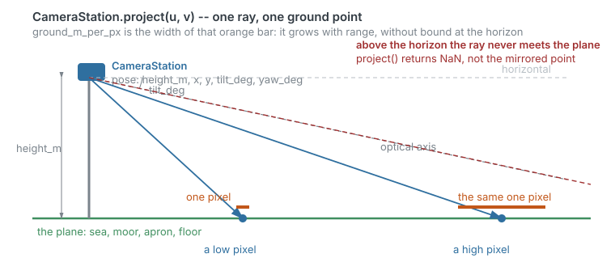
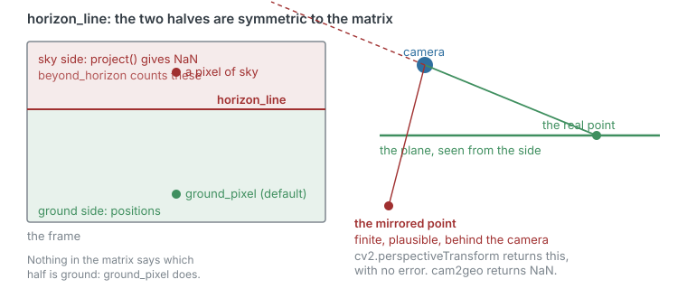
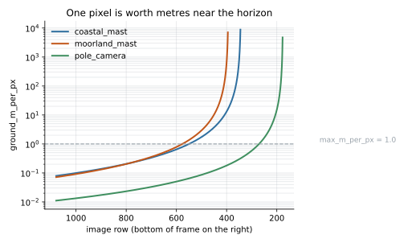
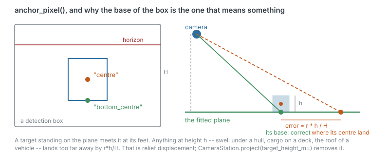
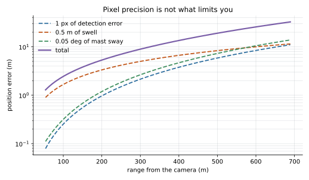
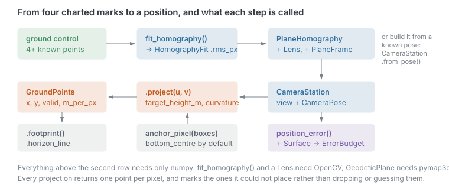

# cam2geo

**Put a fixed camera's pixels on the ground.** A camera that does not move,
looking at a surface that is flat enough, plus a handful of points whose
coordinates you know — and every detection becomes a position.

```
pip install cam2geo                       # numpy only
pip install 'cam2geo[lens,geodetic]'      # + OpenCV and pymap3d
```

---

## The situation

You have a camera on a headland, watching a bay.

It does not move. The sea it watches is, to a very good approximation, a plane —
and that single fact replaces an entire calibration pipeline. A moving camera
needs telemetry, a pose estimate, and a projection chain. A fixed camera looking
at a plane needs one 3×3 matrix, because that matrix already absorbs the pose,
the intrinsics and the ground plane together.

The sea is the clearest case, but it is not the only one. What matters is not
"flat" but **what breaks the plane**:

| area of operation | what breaks the plane |
|---|---|
| open sea, lakes, estuaries, harbours | swell and tide move the plane under you; curvature at long range |
| tidal flats, mudflats, sabkha, beaches | the tide again — the surface itself is flat |
| playas, salt flats, dry lake beds | almost nothing; the flattest ground there is |
| sea ice, frozen lakes, ice shelves | pressure ridges and sastrugi, a decimetre or so |
| sand sheets and gravel plains | little — though dune fields are the opposite case |
| steppe, prairie, pampas, moorland | long-wavelength relief: the plane is local, not global |
| floodplains, deltas, polders | drainage grade, a fraction of a per cent |
| paddy and laser-levelled fields | crop height — a constant offset, easily removed |
| runways, taxiways, aprons | drainage crossfall: a *tilt*, which costs nothing (see below) |
| ports, container yards, rail yards, car parks | engineered flat; stacked cargo is not |
| sports pitches | a slight camber |
| warehouse, factory and retail floors | nothing — the ideal case, and why homographies are standard in people tracking |
| quarry benches, open-pit floors, solar farms | flat *per bench*, not across them |

The engineered surfaces are where this model is at its **best**: somebody built
them flat to a published tolerance, and that tolerance goes straight into the
error budget.

## The geometry, in one picture



One ray, one ground point. Two things follow immediately, and they are the two
things this library exists to get right.

**A pixel above the horizon has no ground point.** Inverting it anyway gives a
finite, entirely plausible number — a position *behind the camera*.
`cv2.perspectiveTransform` returns that, silently. This library returns NaN.

**A pixel is not a fixed patch of ground.** Its footprint grows without bound
toward the horizon, so a detection a few rows too high produces a position
kilometres out to sea.





## The walk-through

Four charted marks to a latitude and longitude. The full runnable version is
[`examples/from_gps_control_points.py`](examples/from_gps_control_points.py).

**1. Survey.** Get at least four points on the water whose coordinates you know —
charted marks, a GPS visit, corners picked off a satellite image — and find them
in the image. Spread them out; four points clustered in the near field will fit
beautifully and extrapolate terribly.

**2. Fit**, with [`fit_homography`](docs/INTERFACE.md#fit_homography):

```python
fit = fit_homography(control_deg, control_px, 1920, 1080,
                     frame=GeodeticPlane(), method="exact")
print(fit.rms_px, fit.max_px)      # 0.47 px, 0.66 px
```

Read the residuals before anything else. They are the only honest signal you will
get about the survey, and they feed the error budget later.

**3. Say where the camera stands**, with
[`CameraStation`](docs/INTERFACE.md#camerapose-and-camerastation). This is an
input, never recovered from the matrix — decomposing a hand-fitted homography
into a pose is unreliable enough that it is [documented as a
limitation](docs/LIMITATIONS.md). You know your own mast height.

```python
station = CameraStation(fit.homography, CameraPose(height_m=30.0, x=LON0, y=LAT0))
```

**4. Project**, through
[`anchor_pixel`](docs/INTERFACE.md#anchor_pixel) and
[`CameraStation.project`](docs/INTERFACE.md#camerapose-and-camerastation):

```python
anchors = anchor_pixel(x, y, w, h)                 # bottom of the box, by default
placed = station.project(anchors[:, 0], anchors[:, 1],
                         max_m_per_px=1.0, curvature=True)
```

```
 box    longitude    latitude   range m     m/px    +/- m
   0    -4.140021   50.350566      62.9    0.105      1.2
   1    -4.139646   50.350832     100.3    0.235      2.0
   2    -4.140563   50.351616     189.9    0.828      4.0
   3           --          --   beyond the horizon
```

The fourth box is not an error and not a dropped row. It is a detection the
geometry cannot place, reported as such.

**Why the bottom of the box?** A vessel meets the plane at its waterline. Its
centre floats above it, and anything at height `h` lands too far away by
`r·h/H` — at 269 m from a 30 m mast, one metre of height costs nine metres of
position.



**5. Know what it is worth**, with
[`position_error`](docs/INTERFACE.md#surface-and-position_error-filling-in-the-numbers):

```python
budget = position_error(station, u, v, Surface("sea", offset_sigma_m=0.5),
                        pixel_sigma_px=1.0, pointing_sigma_deg=0.05,
                        control_rms_px=fit.rms_px)
```

This is the part most pipelines skip, and it changes what you build:

> **Pixel precision is almost never the limit.** At 269 m, one pixel is worth
> 1.7 m — while half a metre of uncertainty about the swell is worth 4.5 m, and a
> twentieth of a degree of mast sway is worth 2.1 m. A sharper camera improves
> the smallest term in the budget. A taller mast, a better survey, or a known
> sea state improves the largest.



**6. Mask what you cannot use**, with `footprint` and `horizon_line`. The
footprint comes back as a closed ring of ground coordinates you can plot straight
onto a chart.

**7. Keep it aligned**, with [`align_pixels`](docs/INTERFACE.md#align_pixels-and-realigned).
This is the step most pipelines are missing. The matrix you fitted in step 2
records where the camera pointed *that day*; a gale, a ladder against the bracket
or a warm afternoon moves it, and nothing about the stale matrix looks wrong from
the inside — it still returns plausible positions and still reports good
conditioning.

```python
alignment = align_pixels(reference_px, current_px, lens=lens)
station = station.realigned(alignment.transform)
```

The landmarks need **no coordinates** — a mooring, a sea-wall corner, a chimney
on the far shore will do, as long as they have not moved. On the coastal setup,
0.6° of drift is worth 92 m at 820 m range, and this removes it without a survey.
See [`examples/boresight_from_landmarks.py`](examples/boresight_from_landmarks.py).

## Examples

| | |
|---|---|
| [`from_a_real_image.py`](examples/from_a_real_image.py) | Eight named features off one frame, coordinates off Sentinel-2, then boresighted |
| [`from_gps_control_points.py`](examples/from_gps_control_points.py) | The same, done properly — anchors, budget, footprint, refusals |
| [`boresight_from_landmarks.py`](examples/boresight_from_landmarks.py) | The camera got knocked. Measure the drift and remove it |
| [`terrain_sites.py`](examples/terrain_sites.py) | Three real terrain types, and which errors the corrections actually remove |

More in [examples/README.md](examples/README.md).

## The interfaces



Everything above the second row needs only numpy. `fit_homography` and a `Lens`
need OpenCV; `GeodeticPlane` needs pymap3d. Full reference in
**[docs/INTERFACE.md](docs/INTERFACE.md)**.

Two invariants hold everywhere:

1. **One output per input, always.** Projection never drops a row and never
   raises per pixel.
2. **NaN is the only failure marker.** Check `valid`.

## Try it without a camera

Three real Sentinel-2 scenes, a handful of marks clicked on each, and the whole
path from pixel to coordinate drawn back onto the imagery:

```
uv run --group images python scripts/fetch_images.py
uv run --all-extras --group images python scripts/project_points.py
```

That writes annotated PNGs to `output/`, and prints how far the fitted
homography drifts from the scene's own georeferencing at pixels it was never
fitted on — which is the only number in the exercise that means anything.

The three synthetic cameras every figure and table in the documentation is
computed from are in `docs/setups.py`. They are documentation, not library.

## Documentation

- **[INTERFACE.md](docs/INTERFACE.md)** — every public name, and how to fill in
  the numbers `Surface` and `position_error` ask for.
- **[LIMITATIONS.md](docs/LIMITATIONS.md)** — the error budget in metres, every
  figure computed by a committed script, with a cited bibliography.
- **[TESTS.md](docs/TESTS.md)** — what the 203 tests cover, and more usefully,
  what they do not.

## What this is not

It will not tell you that a position is **correct**. A homography is a
measurement with nothing independent behind it: cross-camera agreement is a
consistency check, not an accuracy one. Two cameras agreeing does not prove
either is right, though disagreement does prove at least one is wrong.

It does not model a moving camera, terrain relief, a stepped surface, or targets
at many unknown heights. Those need more than one plane and more than one view.

## Licence

MIT. See [LICENSE](LICENSE).
