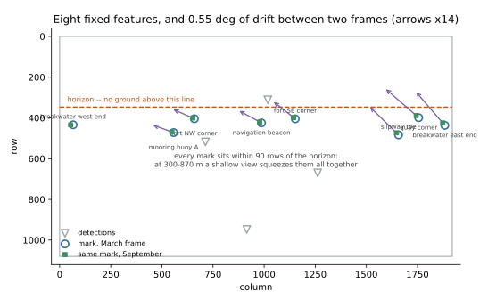
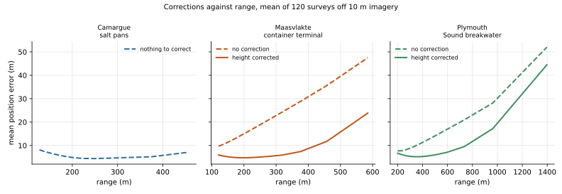

# Examples

Every one is runnable and self-contained. None needs an image, a camera or a
survey — where real data would be needed, a synthetic camera stands in for it and
says so.

```
uv run python examples/from_a_real_image.py
```

| example | what it answers | needs |
|---|---|---|
| [`from_a_real_image.py`](from_a_real_image.py) | Eight named features off one camera frame, coordinates off Sentinel-2, then boresighted against a later frame. | `lens`, `geodetic` |
| [`from_gps_control_points.py`](from_gps_control_points.py) | The same, done properly: box anchors, an error budget, a footprint, and a detection the geometry refuses. | `lens`, `geodetic` |
| [`boresight_from_landmarks.py`](boresight_from_landmarks.py) | The camera has been knocked and I cannot re-survey it. How do I measure the drift and remove it? | `lens` |
| [`terrain_sites.py`](terrain_sites.py) | Three real terrain types, control points off Sentinel-2, and which errors the corrections actually remove. | `lens`, `geodetic` |

```
pip install 'cam2geo[lens,geodetic]'
```

## Where to start

**`from_a_real_image.py`** is the place to start. Eight things you can identify
in both an oblique camera frame and a Sentinel-2 scene — breakwater ends, fort
corners, a beacon, a slipway — with their pixel positions and the coordinates read
off the satellite image, then the same eight found again in a frame taken months
later. That second table is all boresighting needs, and it carries no
coordinates at all.

It also contains the sharpest finding in the repo. Asked to fit those eight marks,
every robust method **invents an outlier that is not there**:

```
  method   threshold   rms px   kept   discarded
  exact           --     8.56      8   --
  ransac        8 px     1.55      7   mooring buoy A
  ransac       20 px     4.94      7   breakwater west end
  lmeds           --     0.04      5   navigation beacon, slipway toe, quay corner
```

Nothing here is an outlier: every mark carries the same 5 m. But RANSAC assumes a
few points are badly wrong, while marks read off coarse imagery are *all* mildly
wrong — the one case it cannot handle. It picks a lucky subset, reports a residual
two hundred times smaller, and is no more accurate. **Use `method="exact"`, and
treat a suspiciously small `rms_px` as a warning rather than a result.**

**`from_gps_control_points.py`** is the same workflow as you would actually run
it: six marks, boxes rather than bare pixels, a conditioning cutoff, the error
budget, and the usable footprint as a ring you can plot on a chart. One of its
four detections is beyond the horizon and comes back reported rather than
dropped.

**`terrain_sites.py`** is the one built on real places and real imagery terms:
salt evaporation ponds, a container terminal and a breakwater, matching three
rows of the README's terrain catalogue. It inverts the error model of the others
— the clicks are good and the *world coordinates* are bad, because they came off
10 m Sentinel-2 — and then adds corrections one at a time, averaged over 400
independent surveys. Averaging is the point: a correction removes a **bias** while
the control error is **noise**, so in any single survey the noise can mask the
correction entirely and even appear to reverse it. Three things it shows that the
synthetic examples cannot:

- **The flattest terrain has nothing to correct.** On the salt pans the surface
  *is* the plane and targets sit on it, so the whole error is survey error. That
  site exists to show the control floor bare.
- **Control points must bracket your working area.** An early draft evaluated
  rows at 7–92 m from marks at 205–425 m, and the extrapolated error exceeded the
  range itself.
- **`position_error` is not to be trusted when control error dominates.** Its
  budget and the measured mean disagree by up to 4× here, in *both* directions,
  because it models survey error as a pixel residual times local scale rather
  than propagating the survey covariance through the fit. Off 10 m imagery, trust
  the measured spread.

**`boresight_from_landmarks.py`** is the maintenance half, and the one most
pipelines are missing. A fitted homography records where the camera pointed *on
the day it was fitted*; a gale, a ladder or a warm afternoon moves it, and every
position afterwards is silently and systematically wrong. The example measures
92 m of error at 820 m range from 0.6° of drift, then removes it using landmarks
whose coordinates are never known — only that they have not moved.

## The figures

Every example is text-only, so nothing needs matplotlib to run. The figures built
from them live in `docs/figures/` and regenerate from a committed script, the same
rule the error tables follow:

```
uv run --group docs python docs/figures/make_figures.py
```

- `marks.svg` — the eight features on the frame, with the horizon and the
  detections, and an arrow per feature showing the drift between the two frames.
- `corrections.svg` — mean position error against range for all three terrain
  sites, corrected and uncorrected, over 120 surveys each.





## Using a real image

The examples above synthesise their pixels so they run anywhere with no
downloads. To point them at a real camera you need two things, and they are
separable:

1. **The image.** Intrinsics are optional — `fit_homography` needs none, and a
   `Lens` only matters if the lens visibly barrels. Pixel coordinates come from
   clicking the frame.
2. **Ground truth for the marks.** Openly-licensed satellite or aerial imagery is
   the usual source: find the same harbour-wall corner or slipway edge in both,
   and read its coordinates off the georeferenced one.

   **Copernicus Sentinel-2 is the one whose terms are verified here** — EU law
   grants reproduction, distribution and modification, commercial use included,
   requiring only the credit `Copernicus Sentinel data [Year]`. But it is **10 m
   per pixel**, so a mark picked off it is good to about ±5 m, which on a 200 m
   scene would be the largest term in your whole error budget — larger than
   everything [LIMITATIONS.md](../docs/LIMITATIONS.md) prices. Good enough to
   demonstrate the workflow; not a survey. Real control points want sub-metre
   national aerial imagery, whose licence you must check per country.

`images/MANIFEST.yaml` records the provenance of anything placed in `images/` —
source URL, licence, attribution and a checksum — and the images themselves are
**not committed**, for licence reasons. Add an entry before adding a file, and
keep the two in step.
